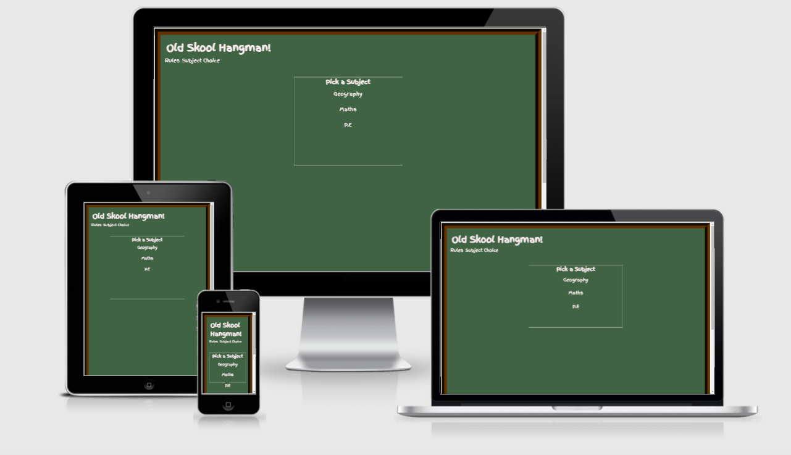
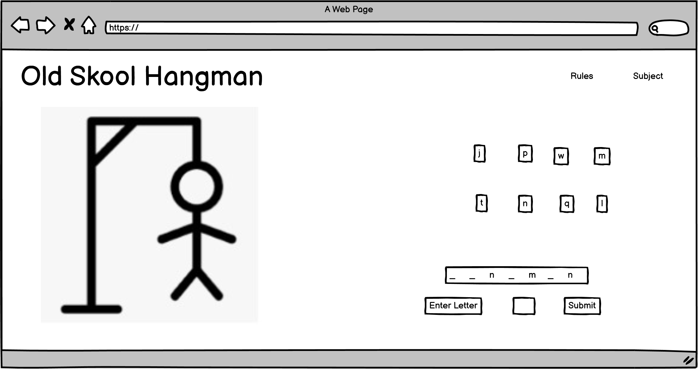
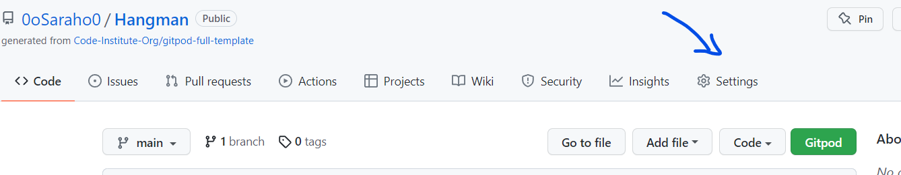
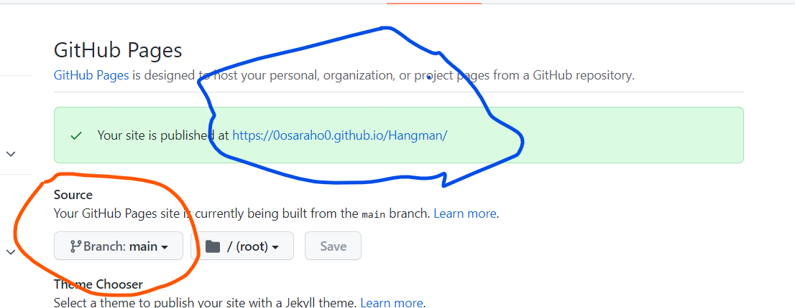

# Old Skool Hangman




[Old Skool Hangman Live Site](https://0osaraho0.github.io/Hangman//)

# Table of Contents
- [About](#about)
- [User Experience (UX)](#user-experience--ux-)
  * [Initial Concept](#initial-concept)
  * [Site Goals](#site-goals)
  * [User Goals](#user-goals)
- [Wireframes](#wireframes)
  * [Colour Schemes](#colour-schemes)
  * [Typography](#typography)
  * [Imagery](#imagery)
- [Features](#features)
  * [Existing Features](#existing-features)
  * [Features left to implement](#features-left-to-implement)
- [Bugs](#bugs)
- [Testing](#testing)
  * [JSHint Test](#jshint-test)
  * [Wave Test](#wave-test)
  * [Jigsaw test](#jigsaw-test)
  * [Lighthouse Tests](#lighthouse-tests)
  * [Nu Html Checker](#nu-html-checker)
  * [](#--html-check--assets-images-w3html-checkpng-)
- [References and Acknowledgments](#references-and-acknowledgments)
- [Technologies Used](#technologies-used)
- [Deployment](#deployment)
- [Personal Devlopment](#personal-devlopment)

<small><i><a href='http://ecotrust-canada.github.io/markdown-toc/'>Table of contents generated with markdown-toc</a></i></small>

# About

This is an interactive game, based on the original style of hangman. I have decided to use a 'back to school' theme, using subject choices similar to those learnt in school.  It is designed to be like playing hangman on an old school chalk board.  The user picks a subject from the 3 choices at the beginning of the game and picks letters to guess a hidden word related to that subject.  Hopefully saving the hangman and guessing the word correctly.  The user has 1o tries to win the game and save the stickman from being hung.

# User Experience (UX)

## Initial Concept

The idea for this game is to create an online version of the pen and paper game hangman.  I have decided to keep to the original theme of hanging the stick man.  Giving it the name 'Old Skool Hangman' I have played on the idea that this is the original 'old school' version with a back to school theme played on a virtual blackboard.

I have used javascript, CSS and HTML to create this game.

The game is targeted at adults who might remember playing hangman at school as a child, and who want to spend a few minutes of their day taking their mind of other things testing their knowledge, guessing words related to subjects taught in school.

The game could be easily adapted with different subject choices by changing the random words to be guessed.

## Site Goals

- To provide a fun game that is intuiuive and easy to navigate.
- To be interactive and fun to play.
- To be fully responsive on all devices.
- To provide a choice of subjects for the user to choose from.

## User Goals

The site will be based on the following user needs.

- I want the site to be easy to use.
- I want the game to be challenging.
- I want each game to only take a few minutes so I can play over my morning coffee or during a lunch break.
- I want the game to be similar to the one I played as a child to gain a feeling of nostalgia.

# Wireframes

I drew my wireframes using Balsamiq.




---

## Colour Schemes

I went for a simple colour scheme.  

I wanted the game to look like it was being played on an old blackboard as part of the back to school theme. 

I chose #406343 for the background because it is the colour of an old chalk board.


For the text colour I chose #FAEDF0 because it looks like chalk writing on the board.


I have used #663300 because it looks like a wooden frame surrounding the chalkboard.


------

## Typography

For this website I chose the font 'finger-paint' for all of the text.  I chose this because it has the look and feel of handwriting on a chalkboard.  This will help provide that feeling of nostalgia at being back at school.


## Imagery

For the image of the Hangman I went for a simple stickman image, just like it would have been drawn when playing as a kid.  The image is made out of separate divs and spans so that they can appear separately as the game is played.


The main game board is made to look like a chalk board that the game is being played on.


---

# Features

## Existing Features

The title Old Skool Hangman written in 'finger paint' font that conveys handwriting on a chalkboard.


The subject choice screen appears first advising the player to 'pick a subject.  When the player hovers over the subject hey show a negative image button that can be clicked.  This gives the user a clear idea that they can click that choice.  This makes it intuitive abd simple to navigate.


Once the subject has been chosen the screen disappears and the hidden word underlines appear.  The text telling the user to enter a letter, and the submit button are in the same font to keep with the theme of the game.  The submit button also has the same hover theme as the other buttons on the page. This is the view on a mobile screen.  Above are the spaces where the letters will appear when guessed correctly


The view on the slightly larger screen shows letter input into the box.  It shows as a black letter on a white background so that it stands out.


The used letters show up on screen so the player knows at a glance what has been used.  Here is the view of the small screen gameplay. 


The used letter box also has a title of used letters so its reallt intuitive what its for.

Because most people know how to play hangman I chose to have a rules button withing the game so the user can choose to view the rules if they wish.  The same button clicks the rules on and off again.

---

## Features left to implement

There are a number of other features I would like to implement moving forward.

- The hangman is currently made out of divs and the lines are very straight and neat.  I would like to draw the hangman and import the images to give it a more authentically drawn look.
- I would like to add animations at the winning and loosing sections of the game. Theese would be of the hangman being saved or being hung, before the loosing screen pops up.
- I would like to make the winning and loosing screens more intersting with images of the aforementioned happy or sad hangman.
- I would like to add difficulty levels to give an added dimension to the game in terms of difficulty.
- I would like to add an overall score of games won and lost.
- I would add x buttons to the rules and subject the pop up screens so it is obvious where to close them.  This will be better UX.

#  Bugs

I noticed that it was possible to input a blank space on the game and it would give give a false value and loose a life.  I tried to fix it by putting a min length of 1 onthe input box but this didn't work.  This is currently still an existing bug.  It does make the user loose a life which is bad UX but it only does it once.

----

It is possible to input numbers which will make you loose a life because there are no words with numbers in them.  I have fixed this bug by writing the code
```
required pattern="[a-zA-Z]"
```
in the input box in the html.  If you input a number now it askes you to please input the requested format.
I have put a <p> under the input box saying to enter letters only, just to make sure it is clear.

----

 The hidden word accepts capital and lower case letters as different guesses. It also does not accept the first letter of each word as correct unless it is a capital.  I fixed part of this problem but adding the code below.  This ensures only lower case letters are entered into the hidden word.

 ```
for (let i = 0; i < randomWord.length; i++) {
let currentWord = randomWord.toLowerCase();
let newLetter = document.createElement('span');
```        
however this did not fix the problem as the initial letter was still only letting a capital letter be input.  I have now fixed the problem with the following code.  It turned out the .toLowerCase() was being added after I had split the word so it needed to be added a little earlier when the word is taken from the array.

```
function displayWord(theArray) {
let randomWord = theArray[Math.floor(Math.random() * theArray.length)].toLowerCase();
document.getElementById('word').innerHTML = "";
```
----
There is a bug with the hidden letters.  You can hightlight the word to cheat.  I have fixed this by adding a font size of 0 so the letters cant be seen and padding so that the bottom border can be seen.  This is not an ideal fix, and does mean that if the user really wanted to, they could cheat by looking in dev tools.

----

# Testing

## JSHint Test

I tested my Javascript with at (www.jsint.com)  There were no errors as you can see below.


## Wave Test

I tested with (https://wave.webaim.org/report#/https://0osaraho0.github.io/Hangman/)


---

## Jigsaw test
I tested with Jigsaw CSS checker 


---

## Lighthouse Tests
I performed the lighthouse test


----

##  Nu Html Checker
I checked with (https://validator.w3.org/nu/)


----

I have also checked the workings of the game.  When you first load the game the subject screen appears.  If you click any of the 3 subjects they will take you to the game with words relating to the given subject.  When you click them they also close the subject box.

There is a rules button that when clicked, opens the rules page.  If you click it again it closes it again.

The form input button only allows a letter to be put in once for each game.  It also accpets capital or lowercase letters but only submits them as lowercase letters.  The form does not accept numbers.

The form submit button submits the letter and it goes into the word if it is correct or part of the hangman is drawn if it is inocorrect.  The letter also appears in the used letters box.

When the game is won a page pops up saying congratulations.  It has a restart button which refreshes the page and starts again.
The same thing happes with the lose page when the player loses.  The restart button works on this page too.

# References and Acknowledgments
Websites used for reference

https://www.w3schools.com/howto/howto_js_toggle_hide_show.asp
https://css-tricks.com/snippets/javascript/select-random-item-array/
https://www.w3schools.com/jsref/met_document_queryselectorAll.asp
https://developer.mozilla.org/en-US/docs/Web/JavaScript/Reference/Global_Objects/String/toLowerCase
https://www.w3schools.com/jsref/prop_style_display.asp
https://developer.mozilla.org/en-US/docs/Web/API/Document/querySelectorAll
https://www.w3schools.com/jsref/jsref_push.asp
https://www.w3schools.com/jsref/prop_element_classlist.asp
https://www.w3schools.com/css/css_align.asp
https://stackoverflow.com/questions/19619428/html5-form-validation-pattern-alphanumeric-with-spaces

I looked at one hangman walkthrough and another students project but I did not use the code directly from either of them
https://github.com/shellieD/Blast-Off/
https://github.com/ironhack-labs/lab-javascript-hangman

I would like to acknowledge my mentor Daisy McGirr, Lead Dave Horrocks and the pp2 slack community for their everlasting patience, help and guidence.

# Technologies Used

- Balsamiq wireframes were used to create my wireframes
- [Color Hunt] (https://colorhunt.co/) was used to help find my colour scheme
- Chrome Dev Tools was used to modify website once the main structure was in.
- [https://wave.webaim.org/] was used to check the accessibility of my site
- [https://jigsaw.w3.org/css-validator/] was used to check the css on my site.
- [https://jshint.com] to check the Javascript
- [https://validator.w3.org/] was used to check the html on my website.
-https://ecotrust-canada.github.io/markdown-toc/ to make my contents links.
- [https://http://ami.responsivedesign.is/] for the media screens

# Deployment

- My website was deployed to GitHub Pages 
- First go to the GitHub repository and select settings
.
- Then scroll down to the GitHub pages section and click the link.

- Then click on the dropdown box below source and pick Branch Main and, indicated in the red circle and click save.
- You will then be deployed, your web address will show in the green banner, in the blue circle.
.
- It can take a couple of minutes for your website to deploy.

# Personal Devlopment

I have learnt a lot over the last couple of weeks.  I have worked hard on this project but unfortunately everything in Javascript seemed to take at least 3 times longer to achieve than I thought it would, and so there are a lot of items in the website I simply did not have time to implement.

However I have made a working game and I am pretty proud of what I have achieved especially since I had no clue where to even start 2 weeks ago.

I think my git commit messages are better in this project than my last, but still need further work.